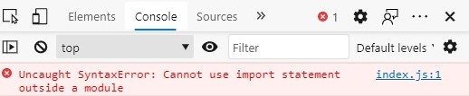
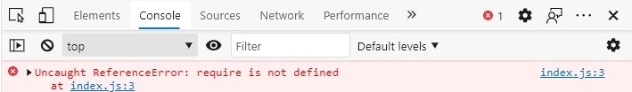
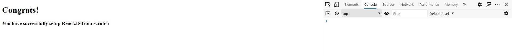

# How to setup a React.js project from scratch

First we are going to setup an NPM project in our project folder. You can do that by executing the following command in the terminal pointing to your project folder.

```
npm init
```

The terminal will prompt you for details about the NPM project. You can enter any valid inputs for these fields as you wish.

Once we have initialized an NPM project in our project folder, we should install React and React DOM. React is for building the React components, while React DOM is responsible for rendering React on the browser. We can add these dependencies to our project by executing the following command, in the terminal like before.

```
npm install react react-dom
```

Now, we shall create two files: index.html which will be the HTML file that gets render on the browser, and index.js which is the script that will get executed when index.html is rendered.

index.html

```html
<!DOCTYPE html>
<html lang="en">

<head>
    <meta charset="UTF-8">
    <meta name="viewport" content="width=device-width, initial-scale=1.0">
    <title>Setup React.js from Scratch - Demo</title>
</head>

<body>
    <!-- This is the HTML element in which the ReactDOM will render -->
    <div id="react-dom-container"></div>

    <!-- This is the script which will load the React App -->
    <script src="index.jsx"></script>
</body>

</html>
```

index.jsx

```javascript
import * as React from "react";
import ReactDOM from "react-dom";

// this is the HTML element in which we want React to render
const reactDomContainer = document.getElementById("react-dom-container");

// arrow function used on purpose here
// to demonstrate how Babel transpiles this code to ES5 syntax
const App = () => {
    return (
        <>
            <h1>Congrats!</h1>
            <h3>You have successfully setup React.JS from scratch</h3>
        </>
    )
}

const rootComponent = App();

// instruct ReactDOM to render our React App in the specified HTML element and
// to mount the specified component
ReactDOM.render(rootComponent, reactDomContainer);
```

Now if we open the HTML file in the browser, we won't see any output. So let us inspect the console and see if we are getting any errors.

</img>

This is because our index.jsx is not defined as an ES6 module and i am using a newer verison of Edge (86.x) which uses a Chromimum engine that can understand ES6 syntax. You can read more on the solution for this issue in <a href="https://stackoverflow.com/questions/58357941/cannot-use-import-statement-outside-a-module">here</a> and <a href="https://stackoverflow.com/questions/52139811/javascript-module-not-working-in-browser">here</a>
However, fixing this issue alone won't solve our brwowser, because of two main reasons:

1. Even if the browser understands ES6, it does not understand JSX.
2. Even if my version of Edge can understand ES6, it is not backwards compatible with older browsers.

Due to these reasons, we will have to convert our ES6 + JSX together to a backwards-compatible verison of Javascript. This is known as "transpiling". For this purpose, we will be using <a href="https://babeljs.io/">Babel</a>.

However, **note that using Babel alone won't work. We will have to use Webpack but the reason will be explained as we go on**

## Babel

Babel is a transpiler that is mostly used to convert newer Javascript code (ES6+) to backwards compatible Javascript code which older browsers can support. In the case of this project, we need to convert JSX (React code) into browser supported JS. Let us add Babel to our project.

```
npm install --save-dev @babel/core @babel/preset-env @babel/preset-react @babel/cli
```

What are these packages?

 - ```@babel/core``` is the core of the Babel compiler
 - ```@babel/preset-env``` and ```@babel/preset-react``` are Babel presets for transpiling ES6 and React code respecitvely. Babel presets are predefined assembly of Babel plugins suitable for common project types and environments. To know more about Babel plugins and presets, visit <a href="https://babeljs.io/docs/en/plugins">here</a> and <a href="https://babeljs.io/docs/en/presets">here</a>. 
  - ```@babel/cli``` is the package which will install the Babel CLI executable in the ```node_modules``` folder. This CLI executable will be used to execute the commands which transpiles the code.

Having installed the Babel dependencies, we shall create a Babel configuration file in the project folder.

babel.config.json

```json
{
    "presets": [
        "@babel/preset-env",
        "@babel/preset-react"
    ],
    "comments": false
}
```

All what we have done in this JSON is tell Babel that it needs to use the ```env``` and ```react``` presets. That is all we need to configure Babel with for the time being.

Thereafter, we may execute the Babel compiler executable installed in our ```node_modules``` folder by exeucting the following command,

```
npx babel index.jsx --out-dir lib
```

This command tells NPX - NPM's in-built package runner, to run the Babel executable installed in the ```node_modules``` folder. What comes after ```babel``` are the arguments to the Babel executable, which is the source file / directory (index.jsx) and the output file / directory (lib).

The newly transpiled JS can be found in the lib/ folder of your project directory. This is what it looks like,

```javascript
"use strict";

function _typeof(obj) { "@babel/helpers - typeof"; if (typeof Symbol === "function" && typeof Symbol.iterator === "symbol") { _typeof = function _typeof(obj) { return typeof obj; }; } else { _typeof = function _typeof(obj) { return obj && typeof Symbol === "function" && obj.constructor === Symbol && obj !== Symbol.prototype ? "symbol" : typeof obj; }; } return _typeof(obj); }

var React = _interopRequireWildcard(require("react"));

var _reactDom = _interopRequireDefault(require("react-dom"));

function _interopRequireDefault(obj) { return obj && obj.__esModule ? obj : { "default": obj }; }

function _getRequireWildcardCache() { if (typeof WeakMap !== "function") return null; var cache = new WeakMap(); _getRequireWildcardCache = function _getRequireWildcardCache() { return cache; }; return cache; }

function _interopRequireWildcard(obj) { if (obj && obj.__esModule) { return obj; } if (obj === null || _typeof(obj) !== "object" && typeof obj !== "function") { return { "default": obj }; } var cache = _getRequireWildcardCache(); if (cache && cache.has(obj)) { return cache.get(obj); } var newObj = {}; var hasPropertyDescriptor = Object.defineProperty && Object.getOwnPropertyDescriptor; for (var key in obj) { if (Object.prototype.hasOwnProperty.call(obj, key)) { var desc = hasPropertyDescriptor ? Object.getOwnPropertyDescriptor(obj, key) : null; if (desc && (desc.get || desc.set)) { Object.defineProperty(newObj, key, desc); } else { newObj[key] = obj[key]; } } } newObj["default"] = obj; if (cache) { cache.set(obj, newObj); } return newObj; }

var reactDomContainer = document.getElementById("react-dom-container");

var App = function App() {
  return React.createElement(React.Fragment, null, React.createElement("h1", null, "Congrats!"), React.createElement("h3", null, "You have successfully setup React.JS from scratch"));
};

var rootComponent = App();

_reactDom["default"].render(rootComponent, reactDomContainer);
```

You can immediately notice that there are no arrow functions or JSX in this file. This is because Babel have transpiled them to a backwards-compatible version of Javascript.

Now, lets modify index.html to point to the transpiled lib/index.js instead of index.jsx.

```html
<!-- <script src="index.jsx"></script> -->

<!-- REPLACE THE ABOVE IN YOUR CODE
WITH WHAT'S GIVEN BELOW -->
<script src="lib/index.js"></script>
```

Now, let us run our index.html once again in the browser.

It seems there is no output yet. Let us once again check the console for errors.

</img>

We have another error now that says "require is not defined". If you revisit the transpiled index.js code and observe carefully, you will notice that the code uses the "require" import syntax used for CommonJS modules which are common in Node.JS (if you are familiar with Node.JS). Once again, the browser does not understand the "require" import syntax.

## Webpack

So we will use Webpack. Webpack is a tool that bundles Javascript modules together. Let us install Webpack for our project.

```
npm install webpack webpack-cli --save-dev
```

Furthermore, to make Babel work with Webpack, we will add the ```babel-loader``` Webpack loader.

```
npm install babel-loader --save-dev
```

A Webpack loader can be simply understood as a "plugin" of sorts that is used to preprocess files before they are bundled. To know more about loaders, visit the Webpack docs <a href="https://webpack.js.org/loaders/">here</a> and the Babel Loader <a href="https://webpack.js.org/loaders/babel-loader/">here</a>. 

Now let us create a Webpack configuration script with the following:

webpack.config.js

```javascript
const path = require('path');

module.exports = {
    mode: "development",
    entry: './index.jsx',
    // This object contains the configuration for Webpack
    output: {
        // outputs the bundled file to the dist folder
        path: path.resolve(__dirname, 'dist'),
        filename: 'bundle.js'
    },
    module: {
        rules: [
            {
                // string regex that matches all javascript files in the project directory
                test: /\.(js|jsx)$/,
                // exclude the node modules folder
                exclude: /(node_modules)/,
                use: {
                    loader: 'babel-loader',
                    options: {
                        // this object is equivalent to the babel.config.json file
                        "presets": [
                            "@babel/preset-env",
                            "@babel/preset-react"
                        ],
                        "comments": false
                    }
                }
            }
        ]
    }
}
```

Thereafter, you can run

```
npx webpack
```

and Webpack will bubdle your JS together and output it to the dist/ folder, where you can find the bundle.js file.

Now, in our index.html, let us use the new bundle.js file,

```html
<!-- <script src="lib/index.js"></script> -->

<!-- REPLACE THE ABOVE IN YOUR CODE
WITH WHAT'S GIVEN BELOW -->
<script src="dist/bundle.js"></script>
```

Now let us run the index.html file again ...

Et voila! We have React running on the browser 🥳

</img>
